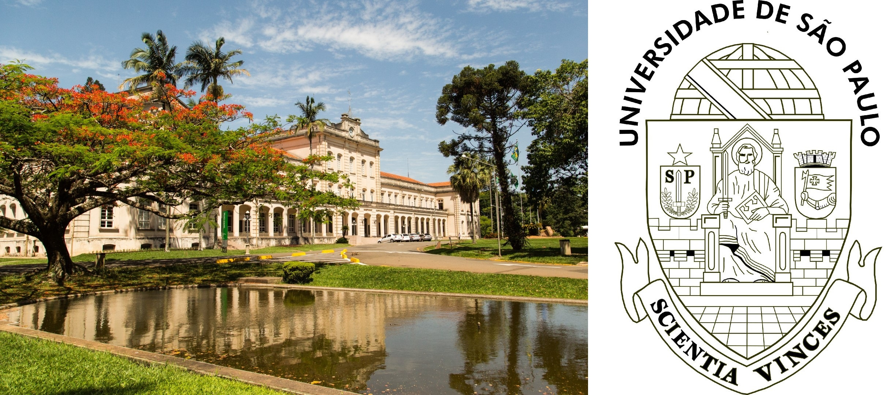
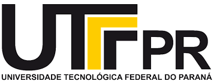
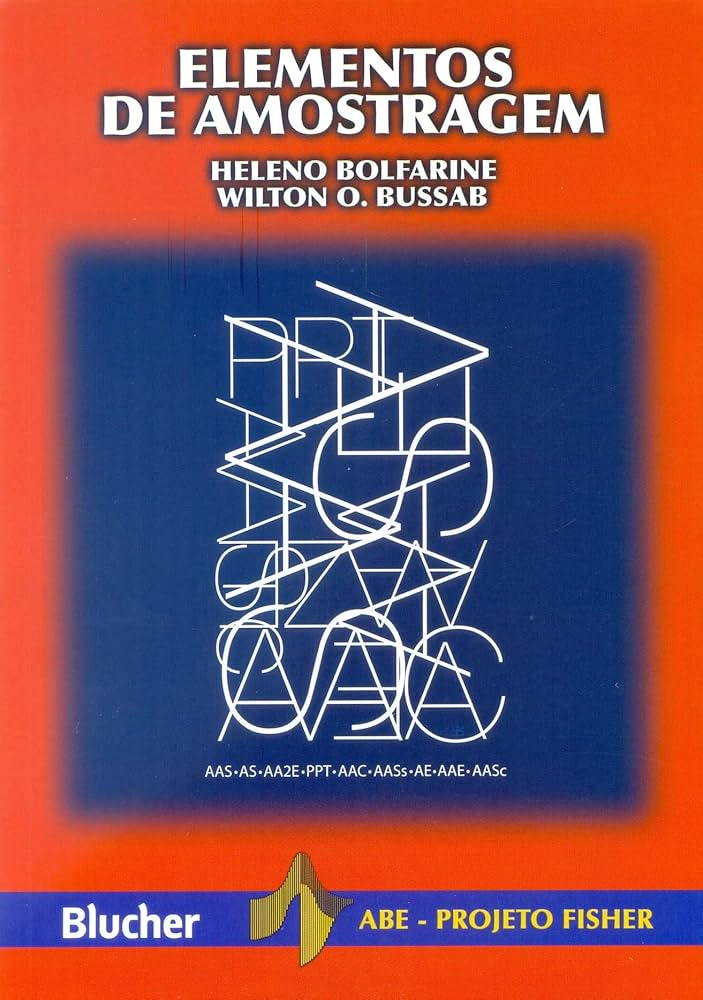
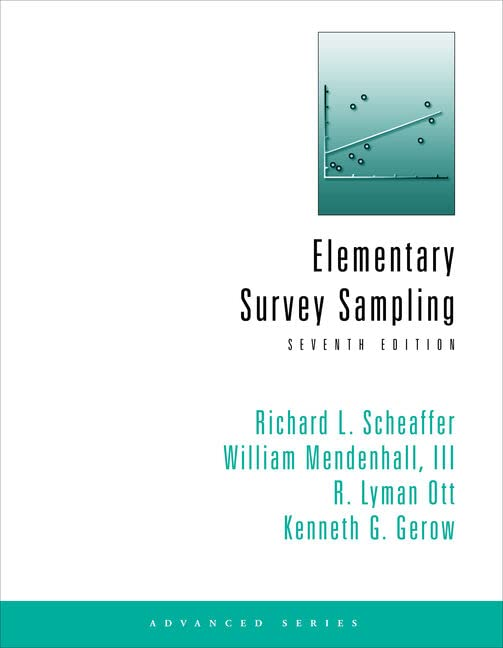

## 🎓 Formação 

<br>

✅ Ensino básico

::: {.fragment}
- 🏫 EMEIF Álvares Machado <br>
:::

<br>

::: {.fragment}
- 🏫 EE Profa. Angélica de Oliveira
:::

<br>

---

✅ Bacharel em Estatística

{fig-align="center" width="35%"}

::: {.fragment}
✅ Mestrado e Doutorado em Ciências

{fig-align="center" width="40%"}
:::

## 🧐 Área de pesquisa 

<br>

:::{.columns}
:::{.column width="60%"}

::: {.fragment}
✅ Análise de sobrevivência
:::

<br>

::: {.fragment}
✅ Estatística experimental
:::

<br>

::: {.fragment}
✅ Modelos de regressão
:::

<br>

::: {.fragment}
✅ Controle estatístico do processo
:::

:::

:::{.column width="40%"}

<br>

<iframe src="https://giphy.com/embed/3orieUe6ejxSFxYCXe" width="345" height="260" style="" frameBorder="0" class="giphy-embed" allowFullScreen></iframe><p><a href="https://giphy.com/gifs/season-16-the-simpsons-16x3-3orieUe6ejxSFxYCXe"></a></p>

:::
:::

## 🏫 Universidades 

<br>

:::{.columns}
:::{.column width="50%"}

:::{.fragment}
{fig-align="center" width="50%"}
:::

<br>

:::{.fragment}
{fig-align="center" width="50%"}
:::

:::

:::{.column width="50%"}

:::{.fragment}
{fig-align="center" width="50%"}
:::

<br>

<iframe src="https://giphy.com/embed/nCVVpakhBTwBi" width="350" height="195" style="" frameBorder="0" class="giphy-embed" allowFullScreen></iframe><p><a href="https://giphy.com/gifs/work-late-nCVVpakhBTwBi"></a></p>

:::
:::

## Apresentar-se

- Nome

- Em uma aula, eu devo abrir o notebook ou o celular quando ... 

{fig-align="right" width=35% height=35%}

## 🎯 Objetivo da disciplina 

<br>

::: {.callout-note}
- Destacar a importância das técnicas de amostragem para obter informações sobre uma população.

- Compreender os principais conceitos dos métodos de amostragem.

- Aplicação das técnicas.
:::

## ⏰ Horário

<br>

Aulas

- Segunda-feira das 13:20 ~ 17:00   

:::{.fragment}
- **Tolerância:** 10 minutos 
:::

:::{.fragment}
- **Intervalo:** 20 minutos
:::

## 📖 Conteúdo Programático 

<br>

:::{.fragment}
✅ Estimadores razão e regressão
:::

<br>

:::{.fragment}
✅ Amostragem por conglomerado em um e dois estágios
:::

<br>

:::{.fragment}
✅ Amostragem de populações móveis
:::

## 📚 Bibliografia básica 

<br>

:::{.columns}
:::{.column width="50%"}
✅ BOLFARINE & BUSSAB (2005)
  
{fig-align="center" width="50%"}
:::

:::{.column width="50%"}
✅ SCHEAFFER et al. (2011)

{fig-align="center" width="55%"}
:::
:::

## 📚 Bibliografia complementar 

<br>

- COCHRAN (1997)  

- BARNETT (1982) 

- KISH (1995) 

- YATES (1981)

- THOMPSON (1992)

## &#128105;&#8205;&#127979; Aulas

<br>

:::{.fragment}
Como você gostaria de ser tratado?
:::

<br>

{fig-align="right" width="35%" height="35%"}

## ✍️ Lista de exercícios 

::: {.justificado}
Haverá listas de exercícios para serem resolvidas em casa. Resolver os problemas da lista de exercícios é uma forma de aprendizagem, pois é uma maneira de colocar em prática tudo que você leu e ouviu, e vai lhe fornecer um *feedback* sobre o que foi abordado em sala de aula.
:::

{fig-align="center" width="25%"}

:::{.justificado}
&#10004; Vocês são **encorajados** a resolver problemas com os outros estudantes, compartilhar e discutir ideias.


&#10004; As respostas de cada problema devem ser **resultados de seu próprio esforço**. 
:::

## Complementação de carga horária

<br>

:::{.columns}
:::{.column width="50%"}
- Atividades extraclasse
:::

:::{.column width="50%"}

:::
:::

<br>

{width=30% height=30% fig-align="right"}


## 📝 Provas 

:::{.justificado}
Haverá duas avaliações que vão cobrir o conteúdo abordado em sala de aula, as listas de exercícios e as bibliografias citadas. As soluções de cada uma das provas devem estar bem **organizadas** e **justificadas**. Desta forma, você irá demonstrar sua capacidade de comunicar os seus resultados. Se a prova estiver **difícil de compreender** devido a organização e passagens não justificadas, haverá **penalidades**.
:::

:::{.columns}
:::{.column width="33.33%"}
- Prova 1

**05/10/2026**
:::

:::{.column width="33.33%"}
- Prova 2

**23/11/2026**
:::

:::{.column width="33.33%"}
- Prova 3

**14/12/2026**
:::
:::


## 🔢 Critério de avaliação

Resolução 106/2012, 23/2013 e 75/2016:

:::{.justificado}
&#10004; Será aprovado o aluno que obtiver média final (MF) maior ou igual a 5 $(MF\geq5)$, em que
		$$MF=0,3N1+0,4N2 +0,3N3,$$
em que $Ni$ é a nota da $i$-ésima prova ($i=1,2,3$) somado ao $i$-ésimo quiz.
:::

<br>

:::{.justificado}
&#10004; Para $MF$ poderá ser acrescentado um bônus por engajamento.
:::

---

:::{.justificado}

&#10004; O aluno com $MF<5$ deverá fazer um exame final no dia 18-01-2027 (com todo o conteúdo e sem consulta).

Então,
$$MFr=\frac{MF+NE}{2},$$ 
em que $NE$ é a nota do exame final.

Dessa forma, $$NF=\min(5,MFr).$$
Será aprovado o aluno com $NF\geq5$.
:::

## 🚫 Desonestidade acadêmica

{fig-align="center" width="40%"}

A desonestidade em nosso trabalho representa uma **grave violação ética**.

## Recomendações

{fig-align="center" width="40%"}

:::{.incremental}
- **Não utilizar o celular** durante a aula, a menos que seja pedido;

- **Não há a necessidade** de utilizar o *notebook*, a não ser que seja pedido;

- Dosar o tempo de saída durante as aulas;

- Faltas não serão removidas, a não ser que seja um erro de digitação.
:::

---

{fig-align="center" width="20%"}

:::{.justificado}
- Se você faltar em uma aula, é **sua responsabilidade** saber o que foi discutido;

- Sair da aula com a sensação de que entendeu a materia não é um indício de que você entendeu a matéria, e nem de que a matéria é fácil. **Faça exercícios e leia um livro**.

- **Estar nesta disciplina é uma decisão sua**. Por isso, espero postura, respeito e responsabilidade com a disciplina.
:::

---


<br>

:::{.columns}
:::{.column width="60%"}

&#10004; <https://moodle.unesp.br/>

<br>

&#10004; Graduação - busca: amostragem

<br>

&#10004; 2026 - Amostragem II

<br>

&#10004; Senha: am2
:::

:::{.column width="40%"}
```{r , echo=FALSE, fig.align = 'left', out.width = '80%'}
knitr::include_graphics('https://media.giphy.com/media/IoP0PvbbSWGAM/giphy.gif')
```
:::
